# TL; DR
These scripts are created to take the output of SageMaker Labeling job, output.manifest, and turn it into PascalVOC format. Also it will generate train and test split data sets for image classification task. Scripts can be run locally and assumes AWS CLI has been configured.

Once your workers have finish the labeling job, update the details inside input.json. ex.

```
{
    "s3_bucket":"label-jobs",
    "job_id":"bounding-box",
    "ground_truth_job_name":"cats-and-dogs",
    "yolo_output_dir":"annoted_files",
    "photo_dir":"images"
}
```

And to generate your annotations run:
```
$ python create_annotations.py
```

# Creating Your Labeling Job

## Setting up your S3 Bucket

The first thing you need to do is to upload the training images to an S3 bucket. Name the bucket ground-truth-data-labeling. You want each labeling task to have its own self-contained folder under this bucket. If you start labeling a small set of images that you keep in the first folder, but find that the model performed poorly after the first round because the data was insufficient, you can upload more images to a different folder under the same bucket and start another labeling task.

For the first labeling task, create the folder **bounding_box** and the following three subfolders under it:

* **images** – You upload all the images in the Ground Truth labeling job to this subfolder.
* **ground_truth_annots** – This subfolder starts empty; the Ground Truth job populates it automatically, and you retrieve the final annotations from here.
* **annot_files** – This subfolder also starts empty, but eventually holds the annotation files ready for model training. The script populates it automatically.

If your images are in .jpeg format and available in the current working directory, you can upload the images with the following code:
```
$ aws s3 sync . s3://label-jobs/bounding-box/images/ --exclude "*" --include "*.jpg"
```

## Creating the manifest file

A Ground Truth job requires a manifest file in JSON format that contains the Amazon S3 paths of all the images to label. You need to create this file before you can start the first Ground Truth job. The format of this file is simple:

```
{"source-ref": < S3 path to image1 >}
{"source-ref": < S3 path to image2 >}
...
```
However, creating the manifest file by hand would be tedious for a large number of images. Therefore, you can automate the process by running a script, by first updating the input.json file, and running:
```
$ python prep_gt_job.py
```
This script reads the S3 bucket and job names from the input file, creates a list of images available in the images folder, creates the manifest.json file, and uploads the manifest file to the S3 bucket at *s3://label-jobs/bounding-box/*.

At this point, the folder structure in the S3 bucket should look like the following:
```
label-jobs
|-- bounding_box
    |-- ground_truth_annots
    |-- images
    |-- annot_files
    |-- manifest.json
```

## Creating the Ground Truth job

You’re now ready to create your Ground Truth job. You need to specify the job details and task type, and create your team of labelers and labeling task details. Then you can sign in to begin the labeling job.

### Specifying the job details
To specify the job details, complete the following steps:

1. On the Amazon SageMaker console, under Ground Truth, choose Labeling jobs.
> 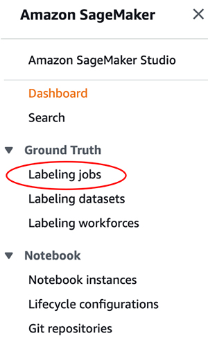

2. On the Labeling jobs page, choose Create labeling job.
> 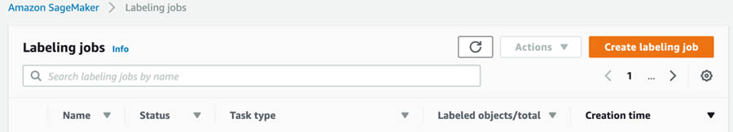

3. In the **Job overview** section, for **Job name**, enter yolo-bbox. It should be the name you defined in the input.json file earlier.
4. **Pick Manual Data Setup** under **Input Data Setup**.
5. For **Input dataset location**, enter s3://label-jobs/bounding-box/manifest.json.
6. For **Output dataset location**, enter s3://label-jobs/bounding-box/ground_truth_annots.
> 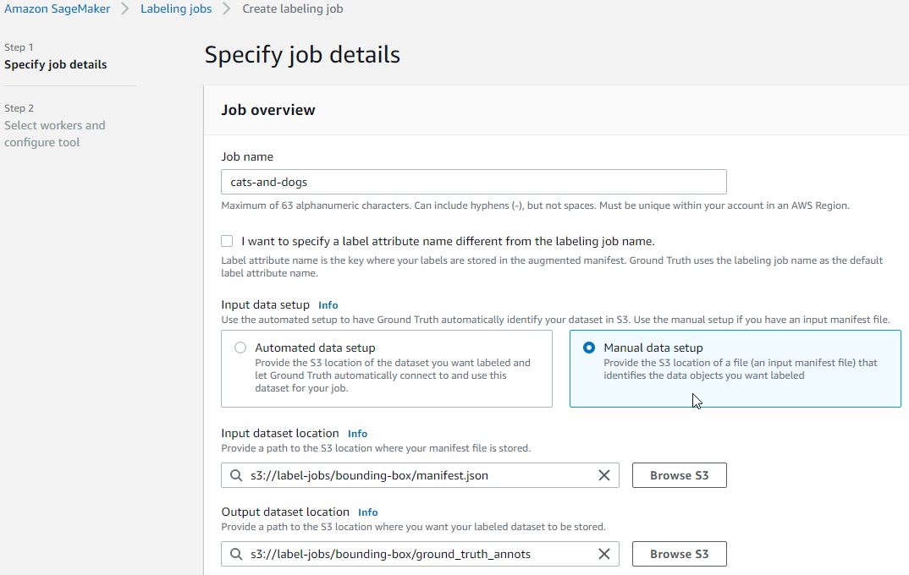


7. In the Create an **IAM role** section, first select **Create a new role** from the drop down menu and then select **Specific S3 buckets**.
8. Enter ground-truth-data-labeling.
> 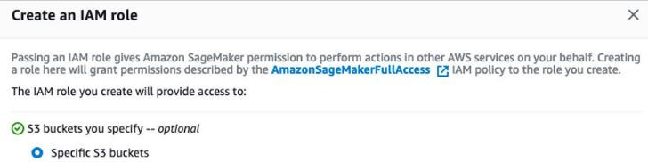
9. Choose **Create**

### Specifying the task type

To specify the task type, complete the following steps:

1. In the **Task selection** section, from the **Task Category** drop-down menu, choose **Image**.
2. Select **Bounding box**.
> 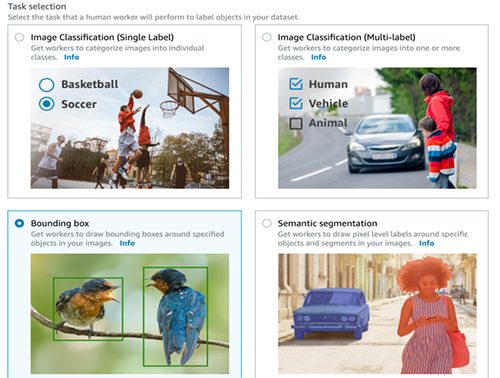
3. Don’t change **Enable enhanced image access**, which is selected by default. It enables Cross-Origin Resource Sharing (CORS) that may be required for some workers to complete the annotation task.
4. Choose **Next**.


## Creating a team of labelers

To create your team of labelers, complete the following steps:

1. In the **Workers** section, select **Private**.
2. Follow the instructions to create a new team.
> 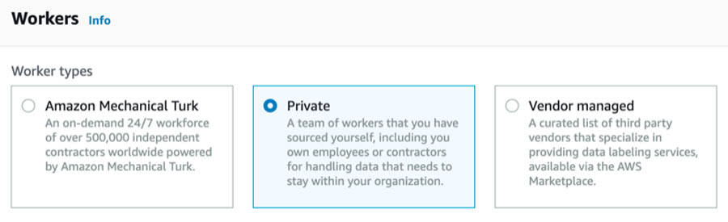

Each member of the team receives a notification email titled, ***"You’re invited to work on a labeling project"*** that has initial sign-in credentials. For this use case, create a team with just yourself as a member.

## Specifying labeling task details

In the **Bounding box labeling tool** section, you should see the images you uploaded to Amazon S3. You should check that the paths are correct in the previous steps. To specify your task details, complete the following steps:

1. In the text box, enter a brief description of the task.

This is critical if the data labeling team has more than one members and you want to make sure everyone follows the same rule when drawing the boxes. Any inconsistency in bounding box creation may end up confusing your object detection model. For example, if you’re labeling beverage cans and want to create a tight bounding box only around the visible logo, instead of the entire can, you should specify that to get consistent labeling from all the workers. For this use case, you can enter Please enter a tight bounding box around the entire object.

2. Optionally, you can upload examples of a good and a bad bounding box.

You can make sure your team is consistent in their labels by providing good and bad examples.

3. Under **Labels**, enter the names of the labels you’re using to identify each bounding box; in this case, pencil and pen.

A color is assigned to each label automatically, which helps to visualize the boxes created for overlapping objects.

4. To run a final sanity check, choose **Preview**.
> 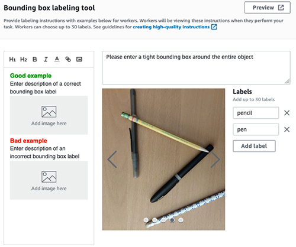

5. Choose **Create job**.

Job creation can take up to a few minutes. When it’s complete, you should see a job titled **cats-and-dogs** on the Ground Truth Labeling jobs page with In progress as the status.

6. To view the job details, select the job.

This is a good time to verify the paths are correct; the scripts don’t run if there’s any inconsistency in names.

## Sign in and start labeling

After you receive the initial credentials to register as a labeler for this job, follow the link to reset the password and start labeling.

If you need to interrupt your labeling session, you can resume labeling by choosing **Labeling workforces** under **Ground Truth** on the SageMaker console.
> 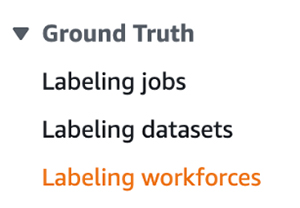

You can find the link to the labeling portal on the **Private** tab. The page also lists the teams and individuals involved in this private labeling task.
> 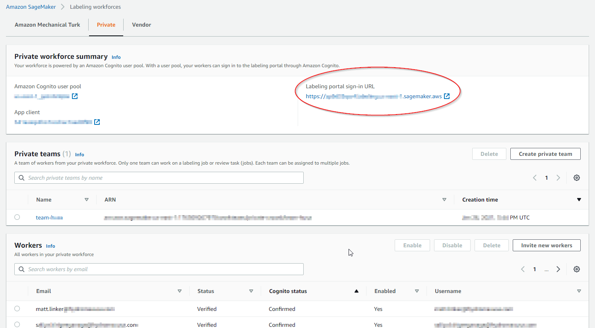

After you sign in, start labeling by choosing **Start working**.
> 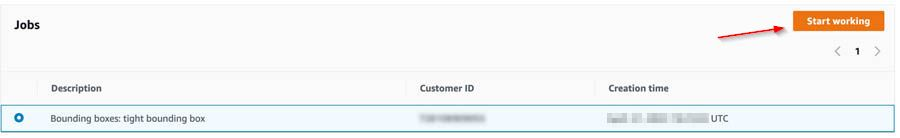


## Checking label job status

After the labeling is complete, the status of the labeling job changes to Complete and a new JSON file called ***output.manifest*** containing the annotations appears at:
```
s3://label-jobs/bounding_box/ground_truth_annots/cats-and-dogs/manifests/output /output.manifest
```

## Parsing Ground Truth annotations
You can now parse through the annotations and perform the necessary post-processing steps to make it ready for model training. 
```
$ python create_annotations.py
```

Ground Truth returns the bounding box information using the following four numbers: x and y coordinates, and its height and width. The script scans through the output.manifest file and stores the information for every bounding box into a pandas dataframe. It then creates PascalVOC .xml annotation files, along with training splits. To configure the training split edit the train_frac parameter in create_annotations.py
```
train, test = split_to_train_test(df_annot[["category","img_file"]], "category", train_frac=0.85)    
```

After which inside the code repository folders Annotations and Train_Split will resemble this:
> 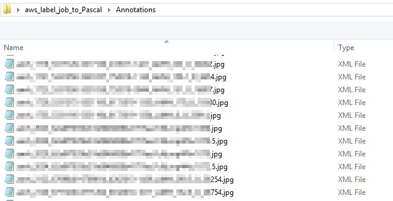
> 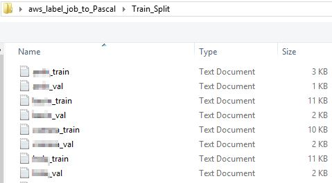

